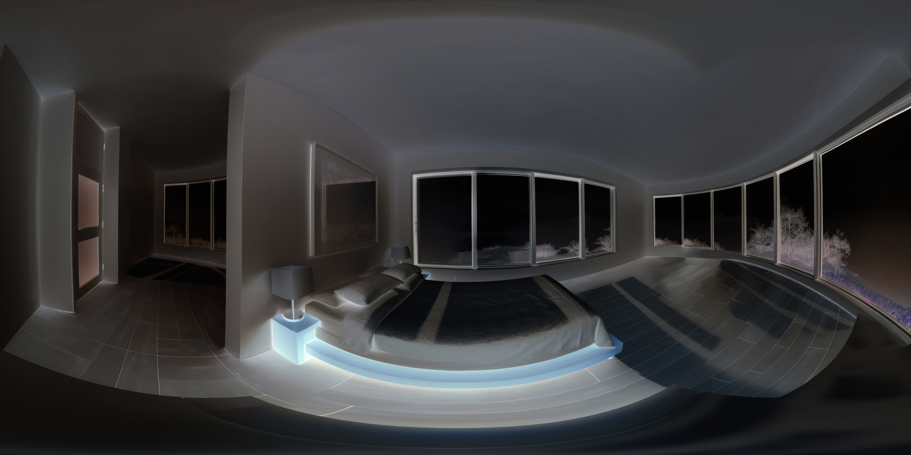

# 🚀 360 背景版快速上手

## 📦 你需要的檔案

```
sel-vr-360.html  ← 主程式（已完成）
sel-1.jpg        ← 場景 1 背景圖
sel-2.jpg        ← 場景 2 背景圖
sel-3.jpg        ← 場景 3 背景圖
sel-4.jpg        ← 場景 4 背景圖
sel-5.jpg        ← 場景 5 背景圖
sel-6.jpg        ← 場景 6 背景圖
```

**全部放在同一個資料夾，一起上傳！**

---

## ⚡ 3 分鐘快速開始

### 選項 A：沒有圖片也能用 ✅

**好消息：** 即使沒準備圖片，程式也能正常運作！

1. 只上傳 `sel-vr-360.html`
2. 開啟網址
3. 會自動使用純色背景
4. 所有功能都正常

**何時用這個方式？**
- 快速測試功能
- 還沒準備圖片
- 確認流程是否正確

### 選項 B：使用自己的 360 圖片 🎨

**步驟：**

1. **準備圖片**
   - 用手機 360 相機 App 拍攝
   - 或從免費網站下載

2. **重新命名**
   ```
   classroom.jpg  →  sel-1.jpg
   library.jpg    →  sel-2.jpg
   ...
   ```

3. **檢查規格**
   - 格式：JPG
   - 解析度：至少 2048 x 1024
   - 大小：每張 < 3 MB

4. **與 HTML 放一起**
   ```
   專案資料夾/
   ├── sel-vr-360.html
   ├── sel-1.jpg
   ├── sel-2.jpg
   ├── sel-3.jpg
   ├── sel-4.jpg
   ├── sel-5.jpg
   └── sel-6.jpg
   ```

5. **全部上傳**
   - 上傳到 Google Drive / GitHub Pages / 學校伺服器
   - 確認全部檔案都上傳了

6. **測試**
   - 開啟網址
   - 看到「載入 360 背景圖... 0 / 6」
   - 等待載入完成
   - 進入場景 1

---

## 🎬 快速拍攝指南

### 用手機 3 步驟拍攝

**1. 下載 App**（選一個）
- iOS：Google Street View
- Android：Google Camera（Photo Sphere）

**2. 拍攝**
- 開啟 App
- 選擇「360 全景」模式
- 站在場景中央
- 依照指示旋轉拍攝

**3. 匯出**
- 儲存到相簿
- 傳到電腦
- 重新命名

**就這麼簡單！**

---

## 🌐 免費 360 圖片資源

### 推薦網站

**1. Poly Haven**
- 網址：https://polyhaven.com/
- 優點：高品質、免費商用
- 適合：各種室內外場景

**2. Flickr Equirectangular**
- 網址：https://www.flickr.com/groups/equirectangular/
- 優點：真實場景、種類多
- 注意：確認授權

### 搜尋關鍵字
- `equirectangular`
- `360 panorama classroom`
- `360 school corridor`

---

## 📋 場景對應建議

| 場景 | 檔名 | 建議場景 | 情緒 |
|------|------|---------|------|
| 1 | sel-1.jpg | 清晨教室 | 安靜、內省 |
| 2 | sel-2.jpg | 有水的地方 | 平靜、放鬆 |
| 3 | sel-3.jpg | 學校走廊 | 公共空間 |
| 4 | sel-4.jpg | 樓梯間 | 等待、私密 |
| 5 | sel-5.jpg | 操場分岔路 | 選擇、決定 |
| 6 | sel-6.jpg | 陽光校園 | 正向、光明 |

---

## ✅ 測試清單

### 上傳前
- [ ] 檔名正確（sel-1.jpg ~ sel-6.jpg）
- [ ] 全部小寫
- [ ] 副檔名是 .jpg
- [ ] 每張 < 3 MB

### 上傳後
- [ ] 全部 7 個檔案都上傳了
- [ ] 開啟網址能看到載入畫面
- [ ] 看到「6 / 6」載入完成
- [ ] 每個場景都能看到 360 圖

### VR 測試
- [ ] 可以用滑鼠拖曳環視
- [ ] 進入 VR 模式
- [ ] 可以轉頭環視
- [ ] 按鈕互動正常

---

## 🔧 常見問題

**Q: 只準備了 3 張圖片可以嗎？**

A: 可以！缺少的圖片會自動顯示純色。
```
sel-1.jpg  ✅ 顯示圖片
sel-2.jpg  ✅ 顯示圖片
sel-3.jpg  ✅ 顯示圖片
sel-4.jpg  ❌ 顯示純色（米色）
sel-5.jpg  ❌ 顯示純色（橘色）
sel-6.jpg  ❌ 顯示純色（金黃色）
```

**Q: 圖片可以放在子資料夾嗎？**

A: 可以，但需要修改 HTML：
```html
<!-- 找到這些行 -->



<!-- 改成 -->


```

**Q: 載入很慢怎麼辦？**

A: 壓縮圖片：
1. 上傳到 https://tinyjpg.com/
2. 下載壓縮後的檔案
3. 重新上傳

**Q: 可以用 PNG 嗎？**

A: 可以，但 JPG 更小更快。如果用 PNG：
```
sel-1.png
sel-2.png
...

並修改 HTML：

```

---

## 🎯 推薦流程

### 第一次使用（測試）

1. **只上傳 HTML**
2. **確認功能正常**
3. **準備 1-2 張圖片**
4. **測試圖片顯示**
5. **完成全部圖片**

### 正式使用（完整版）

1. **規劃 6 個場景**
2. **拍攝或下載圖片**
3. **優化壓縮**
4. **全部上傳**
5. **完整測試**
6. **分享給學生**

---

## 📊 版本對比

| 版本 | 背景 | 臨場感 | 檔案數 | 大小 |
|------|------|--------|--------|------|
| sel-vr-final.html | 純色 | ⭐⭐ | 1 | 20 KB |
| **sel-vr-360.html** | **360 圖** | **⭐⭐⭐⭐⭐** | **7** | **20 KB + 6-12 MB** |

---

## 💡 小技巧

### 技巧 1：先測試一張
```
只上傳 sel-1.jpg
其他場景會顯示純色
確認圖片格式和解析度正確
```

### 技巧 2：批次重新命名
```
Windows：
選取全部圖片 → F2 → 輸入 sel → Enter
會自動變成 sel (1).jpg, sel (2).jpg...
再手動調整成 sel-1.jpg

Mac：
選取全部圖片 → 右鍵 → 重新命名
選擇格式：名稱和索引
```

### 技巧 3：快速壓縮
```
1. 選取全部圖片
2. 拖曳到 TinyJPG.com
3. 下載壓縮後的 ZIP
4. 解壓縮
5. 重新命名
```

---

## 🎊 完成！

**現在你有：**
- ✅ 完整的 VR 互動體驗
- ✅ 4 大優化功能
- ✅ 360 度真實場景
- ✅ 極致的臨場感

**學生會看到：**
1. 載入 360 背景圖（進度條）
2. 沉浸式 360 環境
3. 可以自由環視
4. 真實的場景臨場感
5. 專業的 VR 體驗

---

## 📞 需要協助？

**遇到問題隨時問我：**
- 圖片格式問題
- 檔案命名問題
- 上傳問題
- 顯示問題

**我會立即協助你解決！** 💪

---

**祝你成功打造超棒的 VR 情緒學習體驗！** 🎉✨
