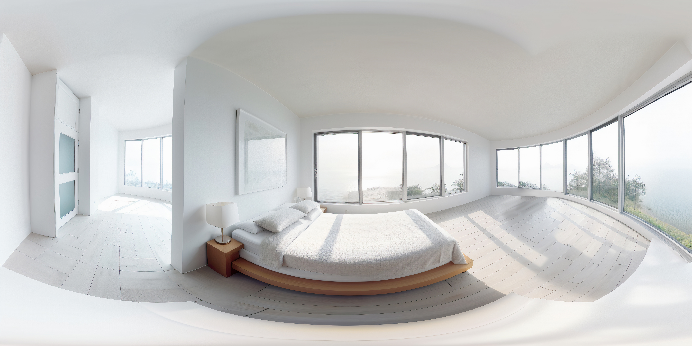

# 📸 360 背景圖完整準備指南

## 🎯 檔案命名規則

請準備以下 6 張圖片，並嚴格按照這個命名：

```
sel-1.jpg  →  場景 1：自我覺察（清晨教室）
sel-2.jpg  →  場景 2：自我管理（安靜的地方）
sel-3.jpg  →  場景 3：社會覺察（走廊）
sel-4.jpg  →  場景 4：人際技巧（樓梯或安靜角落）
sel-5.jpg  →  場景 5：負責任的決策（開闊的地方）
sel-6.jpg  →  場景 6：結尾（陽光燦爛的校園）
```

**⚠️ 命名非常重要！**
- 必須是小寫的 `sel-1.jpg` 不是 `SEL-1.jpg` 或 `sel-1.JPG`
- 數字是 1-6，不是 01-06
- 副檔名必須是 `.jpg`

---

## 📐 圖片規格要求

### 基本規格
- **格式**：JPG（推薦）或 PNG
- **解析度**：至少 2048 x 1024 像素
- **比例**：2:1（寬:高）
- **檔案大小**：每張建議 500 KB - 2 MB

### 推薦規格（更好的效果）
- **解析度**：4096 x 2048 像素
- **格式**：JPG（品質 85-90%）
- **色彩**：RGB 色彩空間
- **檔案大小**：每張約 1-3 MB

### 為什麼是 2:1 比例？
360 度全景圖是「等距圓柱投影」格式：
```
┌────────────────────────────────────┐
│                                     │  ← 高度
│        360 度全景圖                  │
│                                     │
└────────────────────────────────────┘
         ← 寬度（是高度的 2 倍）
```

---

## 📱 如何拍攝 360 圖片

### 方法 1：使用手機全景模式 ✨ 推薦！

#### iPhone
1. 開啟相機 App
2. 選擇「全景」模式
3. **垂直拍攝**（手機直立）
4. 慢慢從左往右移動 180°
5. 重複拍攝另一邊
6. 使用 App 拼接（見下方推薦）

#### Android
1. 開啟相機
2. 選擇「全景」或「360°」模式
3. 依照螢幕指示旋轉拍攝
4. 完成後自動拼接

### 方法 2：使用 360 相機 App

**推薦 App：**

**📱 iOS：**
- **Google Street View**（免費）
  - 可拍攝 360 全景
  - 自動拼接
  - 匯出 JPG 格式

- **Panorama 360 Camera**（免費）
  - 簡單易用
  - 即時預覽
  - 高品質輸出

**📱 Android：**
- **Google Camera**（免費，Pixel 手機內建）
  - Photo Sphere 模式
  - 自動引導拍攝
  - 完美的 360 照片

- **Cardboard Camera**（免費）
  - 專為 VR 設計
  - 含空間音效
  - 直接匯出

### 方法 3：使用專業 360 相機（如果有的話）

- Ricoh Theta
- Insta360
- GoPro MAX

---

## 🎨 如何找免費 360 圖片

如果暫時沒有自己的 360 圖片，可以使用免費資源：

### 推薦網站

**1. Flickr 360**
- 網址：https://www.flickr.com/groups/equirectangular/
- 搜尋：`equirectangular` 或 `360 panorama`
- 選擇：允許商業使用的 CC 授權圖片

**2. Poly Haven (HDRI Haven)**
- 網址：https://polyhaven.com/
- 類型：高品質 360 環境貼圖
- 授權：CC0（完全免費使用）

**3. Pixexid**
- 網址：https://www.pixexid.com/
- 類型：360 全景照片
- 授權：免費商業使用

**4. 360 Cities**
- 網址：https://www.360cities.net/
- 類型：世界各地 360 景點
- 注意：確認授權條款

### 搜尋關鍵字
- `equirectangular`（等距圓柱投影）
- `360 panorama`
- `spherical image`
- `photosphere`

---

## 🎬 場景建議（配合劇情）

### 場景 1：自我覺察（sel-1.jpg）
**建議場景：**
- 清晨的教室（空蕩蕩、光線柔和）
- 安靜的圖書館角落
- 清晨的校園一角

**情緒氛圍：**
- 安靜、內省
- 光線柔和（清晨或傍晚）
- 色調偏暖（橙黃色）

### 場景 2：自我管理（sel-2.jpg）
**建議場景：**
- 有水的地方（池塘、噴泉）
- 安靜的公園長椅
- 禪意空間

**情緒氛圍：**
- 平靜、放鬆
- 自然元素（水、樹）
- 色調偏藍綠

### 場景 3：社會覺察（sel-3.jpg）
**建議場景：**
- 學校走廊（有人走動）
- 公共空間（稍有人群）
- 街道（不要太擁擠）

**情緒氛圍：**
- 公共空間感
- 有人但不擁擠
- 自然光線

### 場景 4：人際技巧（sel-4.jpg）
**建議場景：**
- 樓梯間（兩層之間）
- 走廊轉角
- 長椅（兩個座位）

**情緒氛圍：**
- 等待、期待
- 溫暖色調
- 私密但不封閉

### 場景 5：負責任的決策（sel-5.jpg）
**建議場景：**
- 操場跑道分岔處
- 十字路口
- 開闊的廣場

**情緒氛圍：**
- 選擇、決定
- 視野開闊
- 夕陽時分（橘紅色）

### 場景 6：結尾（sel-6.jpg）
**建議場景：**
- 陽光校園
- 明亮的戶外空間
- 充滿希望的景色

**情緒氛圍：**
- 正向、光明
- 金黃色陽光
- 充滿活力

---

## 📁 檔案放置位置

### 與 HTML 同目錄（最簡單）✨ 推薦

```
專案資料夾/
├── sel-vr-360.html    ← 你的主檔案
├── sel-1.jpg          ← 場景 1 背景
├── sel-2.jpg          ← 場景 2 背景
├── sel-3.jpg          ← 場景 3 背景
├── sel-4.jpg          ← 場景 4 背景
├── sel-5.jpg          ← 場景 5 背景
└── sel-6.jpg          ← 場景 6 背景
```

**然後全部一起上傳到網路空間！**

### 使用子資料夾（進階）

如果想整理檔案：
```
專案資料夾/
├── sel-vr-360.html
└── images/
    ├── sel-1.jpg
    ├── sel-2.jpg
    ├── sel-3.jpg
    ├── sel-4.jpg
    ├── sel-5.jpg
    └── sel-6.jpg
```

**需要修改 HTML 中的路徑：**
```html
<!-- 原本 -->


<!-- 改成 -->

```

---

## 🔧 圖片優化工具

### 線上工具（免費）

**1. TinyJPG**
- 網址：https://tinyjpg.com/
- 功能：壓縮 JPG 圖片，減少檔案大小
- 優點：保持高品質，檔案變小 50-80%

**2. Squoosh**
- 網址：https://squoosh.app/
- 功能：線上圖片壓縮與轉換
- 優點：即時預覽、多種格式

**3. iLoveIMG**
- 網址：https://www.iloveimg.com/
- 功能：批次處理、裁切、壓縮
- 優點：一次處理多張

### 桌面軟體

**1. GIMP**（免費）
- 調整解析度
- 匯出為 2:1 比例
- 壓縮品質控制

**2. Photoshop**（付費）
- 完整編輯功能
- 「儲存為網頁用」功能
- 精確控制檔案大小

---

## ✅ 降級方案（重要！）

### 如果圖片沒準備好怎麼辦？

**不用擔心！** 這個版本有**自動降級機制**：

```
嘗試載入 sel-1.jpg
    ↓
    圖片存在？
    ↓           ↓
   是          否
    ↓           ↓
顯示 360 圖   顯示純色背景
```

### 降級流程

1. **嘗試載入圖片**（5 秒等待時間）
2. **如果失敗**：自動使用純色背景
3. **純色對應**：
   - 場景 1 → 橙黃色 `#FFE5B4`
   - 場景 2 → 藍色 `#B3D9FF`
   - 場景 3 → 灰藍色 `#D5E5F2`
   - 場景 4 → 溫暖米色 `#F5DEB3`
   - 場景 5 → 橘色 `#FFDAB9`
   - 場景 6 → 金黃色 `#FFE66D`

### 測試流程

**階段 1：先測試純色版**
- 使用 `sel-vr-final.html`（不需圖片）
- 確認互動都正常
- 確認流程順暢

**階段 2：準備 1-2 張圖片測試**
- 先準備 `sel-1.jpg` 和 `sel-6.jpg`
- 測試圖片是否顯示
- 確認解析度和品質

**階段 3：完整版**
- 準備全部 6 張圖片
- 全部一起上傳
- 完整測試所有場景

---

## 🎓 製作範例流程

### 情境：用 iPhone 拍攝教室 360 圖

**第 1 步：拍攝**
1. 下載 Google Street View App
2. 開啟 App，點「創建」
3. 選擇「拍攝 Photo Sphere」
4. 站在教室中央
5. 依照指示旋轉拍攝各個角度
6. 完成後自動拼接

**第 2 步：匯出**
1. 在 App 中找到剛拍的照片
2. 點擊「分享」
3. 選擇「儲存到相簿」
4. 照片會自動儲存為 JPG 格式

**第 3 步：重新命名**
1. 將照片傳到電腦
2. 重新命名為 `sel-1.jpg`
3. 確認檔案大小（建議 < 3 MB）

**第 4 步：優化（可選）**
1. 上傳到 TinyJPG 壓縮
2. 確認解析度是 2:1 比例
3. 下載優化後的檔案

**第 5 步：上傳**
1. 與 `sel-vr-360.html` 放在同一資料夾
2. 一起上傳到網路空間
3. 測試是否正常顯示

---

## 🔍 疑難排解

### Q1: 圖片不顯示，只看到純色？

**檢查清單：**
- [ ] 檔名是否正確？（`sel-1.jpg` 不是 `SEL-1.jpg`）
- [ ] 檔案是否與 HTML 在同一目錄？
- [ ] 檔案是否成功上傳？
- [ ] 打開瀏覽器開發者工具看錯誤訊息

**解決方法：**
```
1. 確認檔案命名完全正確
2. 確認檔案都已上傳
3. 重新整理頁面（Ctrl+F5）
4. 檢查瀏覽器控制台的錯誤訊息
```

### Q2: 圖片顯示了，但是變形或模糊？

**可能原因：**
- 解析度太低
- 比例不是 2:1
- 不是等距圓柱投影格式

**解決方法：**
```
1. 確認圖片解析度 ≥ 2048 x 1024
2. 確認寬高比是 2:1
3. 使用專門的 360 相機 App 拍攝
```

### Q3: 圖片載入很慢？

**優化方法：**
```
1. 壓縮圖片（TinyJPG）
2. 降低解析度到 2048 x 1024
3. 使用 JPG 格式（不要用 PNG）
4. 每張控制在 1-2 MB
```

### Q4: 360 圖的視角不對？

**調整方法：**

在 HTML 中找到：
```html
<a-sky id="sky-1" src="#bg-1" rotation="0 -130 0"></a-sky>
```

調整 rotation 的第二個數字（Y 軸旋轉）：
- `-130`：向左旋轉 130 度
- `0`：不旋轉
- `130`：向右旋轉 130 度

**找到最佳角度的方法：**
1. 開啟 VR 體驗
2. 看看哪個角度最舒適
3. 調整 rotation 數值
4. 重新載入測試

---

## 📊 快速參考表

| 項目 | 規格 |
|------|------|
| **格式** | JPG（推薦）或 PNG |
| **解析度** | 2048 x 1024（最低）<br>4096 x 2048（推薦） |
| **比例** | 2:1 |
| **檔案大小** | 500 KB - 2 MB |
| **命名** | sel-1.jpg ~ sel-6.jpg |
| **位置** | 與 HTML 同目錄 |
| **數量** | 6 張（對應 6 個場景） |

---

## 🎯 測試步驟

### 完整測試清單

**準備階段：**
- [ ] 準備 6 張 360 圖片
- [ ] 檔名正確（sel-1.jpg ~ sel-6.jpg）
- [ ] 每張檔案 < 3 MB
- [ ] 與 HTML 放在同一資料夾

**上傳階段：**
- [ ] 全部檔案一起上傳
- [ ] 確認檔案都上傳成功
- [ ] 取得網址

**測試階段：**
- [ ] 用電腦開啟連結
- [ ] 看到載入進度「0/6 → 6/6」
- [ ] 每個場景的 360 圖都顯示
- [ ] 可以用滑鼠拖曳環視
- [ ] 進入 VR 模式測試
- [ ] 用 Cardboard 測試

**如果圖片沒顯示：**
- [ ] 檢查瀏覽器控制台錯誤
- [ ] 確認檔名大小寫
- [ ] 確認檔案路徑
- [ ] 嘗試重新上傳

---

## 🚀 立即開始！

### 最簡單的起步方式

1. **下載範例圖片**（從免費網站）
2. **重新命名**為 sel-1.jpg ~ sel-6.jpg
3. **與 HTML 放一起**
4. **上傳測試**

### 進階製作流程

1. **規劃場景**（參考上面的場景建議）
2. **實地拍攝** 360 圖片
3. **後製優化**（壓縮、調色）
4. **上傳測試**
5. **收集回饋**
6. **持續優化**

---

**準備好體驗真正的 360 VR 臨場感了嗎？** 🎉

有任何問題隨時問我！我會協助你順利完成！
